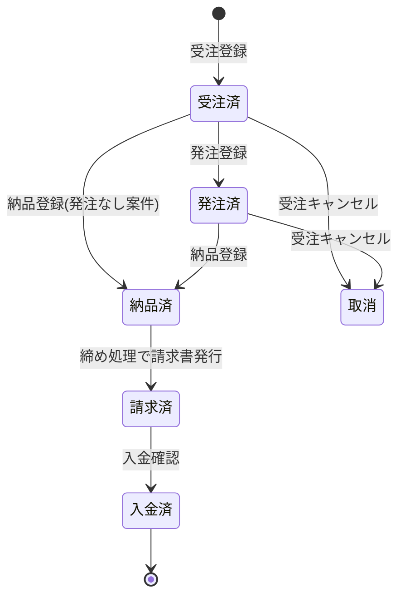
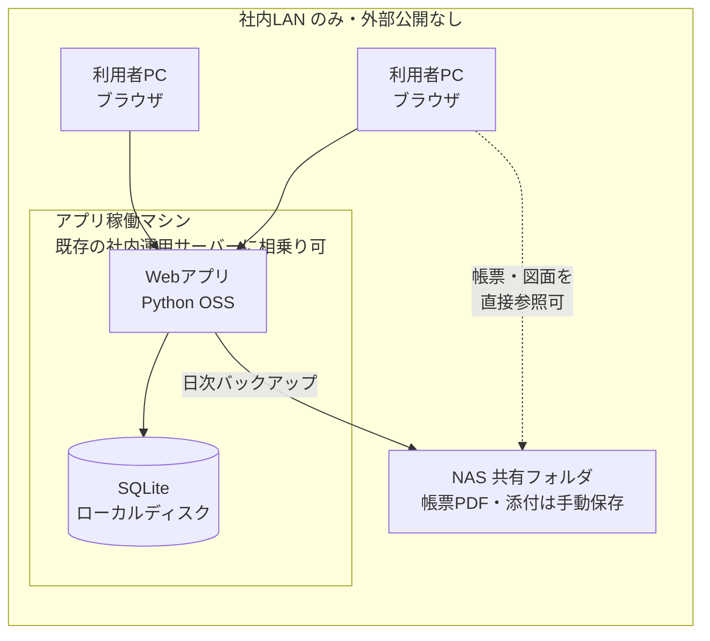

# 販売管理システム 要件定義書

- 版数: 1.0(初版)
- 作成日: 2026-07-20
- 状態: レビュー中

## 1. 背景・目的

### 1.1 現状と課題

現在、受注・発注・納品・請求の管理を Excel シートで行っている。
1件の案件ごとに「受注情報(客先側)」と「発注情報(仕入先側)」を1枚のシートに記録し、納品書・請求書はボタン(マクロ想定)で別シートに転記して発行するイメージである。

この運用には次の課題がある。

| # | 課題 | 影響 |
|---|------|------|
| 1 | 案件ごとのシート管理で全体の一覧性がない | 納期遅れ・発注漏れに気づきにくい |
| 2 | 納品書・請求書への転記が手作業(または壊れやすいマクロ) | 転記ミス、金額・税計算の誤り |
| 3 | 月末の請求対象の抽出が手作業 | 請求漏れ・二重請求のリスク |
| 4 | 受注単価と発注単価の差(粗利)が集計されない | 案件・客先ごとの採算が見えない |
| 5 | 図面や議事録が案件と別管理 | 探す手間、添付漏れ |
| 6 | ファイル共有ベースのため同時編集で壊れる | データ破損・上書き事故 |

### 1.2 目的

- 受注から請求までを **管理No. を軸に一元管理** し、転記レス・請求漏れゼロにする
- 納品書・請求書を **印刷ボタンひとつで A4 印刷** する(請求書は適格請求書=インボイス制度対応。PDF保存はオプション)
- 案件ごとの **粗利(受注額−発注額)を自動計算** し、採算を見える化する
- 社内数名での **同時利用** に耐えるデータ管理にする

## 2. 用語定義

| 用語 | 意味 |
|------|------|
| 管理No. | 案件を一意に識別する社内番号。受注と発注を紐付けるキー(例: 10100) |
| 受注 | 客先から注文を受けること。受注日・客先納期・品名・数量・単価等を記録する |
| 発注 | 受注した品物を仕入先へ注文すること。同じ管理No. に紐付く |
| 客先 | 商品を販売する相手(得意先)。例: ダイゴテック |
| 仕入先 | 商品・加工を調達する相手。例: ゆーいち工業 |
| 客先管理No. | 客先が発行する注文書番号。先方との照合に使う |
| 型式・図番 | 品物の型式または図面番号(例: A0010) |
| 客先納期 | 客先へ納品する期限 |
| 発注納期 | 仕入先から納入してもらう期限。客先納期より前に設定する |
| 締め日 | 請求期間を区切る日。**客先ごとに設定**する(月末、20日、25日など) |
| 締め処理 | 客先ごとの締め日で請求期間(前回締め日の翌日〜今回締め日)を区切り、期間内の納品済み明細を集計して請求書を作成する処理。Excelイメージの「月末処理」ボタンに相当 |
| 粗利 | 受注小計 − 発注小計 |

## 3. 業務フロー

補足:

- 受注のみで発注が発生しない案件(自社在庫・自社加工のみ)も許容する
- 1件の受注に対して複数の仕入先へ発注するケースを許容する
- 納品は分納(複数回に分けての納品)を将来対応とし、初期版は1受注=1納品とする

### 3.1 案件ステータス

- 「請求済」以降の案件は金額・数量の編集をロックする(修正が必要な場合は請求の取消操作を経る)

## 4. 機能要件

### 4.1 機能一覧

優先度は2段階とする: **必須** = 初期版で実装、**オプション** = 初期版では実装せず将来追加(代替運用は 4.11 参照)。

| ID | 機能 | 概要 | 優先度 |
|----|------|------|--------|
| F-01 | 受注管理 | 受注の登録・編集・検索。管理No. 自動採番 | 必須 |
| F-02 | 発注管理 | 受注に紐づく発注の登録・編集。品名等は受注から引継ぎ | 必須 |
| F-03 | 納品管理 | 納品日の記録、納品書のA4印刷(印刷ボタン) | 必須 |
| F-04 | 請求管理(締め処理) | 客先ごとの締め日に基づく請求期間で納品済み明細を集計し請求書をA4印刷。入金済の記録を含む | 必須 |
| F-05 | 明細一覧・検索 | 全案件の一覧表示、日付単位の絞り込み・期間合計表示、CSVダウンロード | 必須 |
| F-06 | マスタ管理 | 客先・仕入先の登録・編集 | 必須 |
| F-07 | 添付管理 | 図面情報・議事録ファイルの案件への添付 | オプション |
| F-08 | 粗利管理 | 受注小計−発注小計の自動計算・一覧表示 | 必須 |
| F-09 | ユーザー管理 | 簡易ログイン、利用者の登録 | オプション |

### 4.2 F-01 受注管理

- 入力項目(Excel イメージの受注側項目を踏襲):

| 項目 | 型 | 必須 | 備考 |
|------|----|------|------|
| 管理No. | 数値 | 自動 | 自動採番(連番)。手入力による欠番・重複を防ぐ |
| 受注日 | 日付 | ○ | 既定値: 当日 |
| 客先納期 | 日付 | ○ | |
| 客先 | マスタ選択 | ○ | 客先マスタから選択(新規はその場で登録可) |
| 客先担当者 | 文字列 | | 例: 山田 |
| 客先管理No. | 文字列 | | 客先の注文書番号 |
| 品名 | 文字列 | ○ | 例: シャフト |
| 型式・図番 | 文字列 | | 例: A0010 |
| 数量 | 数値 | ○ | |
| 単位 | 文字列 | | 例: ヶ。既定値「ヶ」 |
| 単価 | 数値 | ○ | 税抜 |
| 小計 | 数値 | 自動 | 数量 × 単価(税抜)。自動計算・編集不可 |
| 備考 | 文字列 | | 例: 表面処理注意 |

- 検索・編集・削除(削除は論理削除、請求済は編集ロック)

### 4.3 F-02 発注管理

- 受注(管理No.)に紐付けて登録する。1受注に複数発注可
- 品名・型式・図番・数量・備考は受注から自動引継ぎし、修正可能とする(数量の一部発注などに対応)

| 項目 | 型 | 必須 | 備考 |
|------|----|------|------|
| 仕入先 | マスタ選択 | ○ | 仕入先マスタから選択 |
| 発注日 | 日付 | ○ | 既定値: 当日 |
| 発注納期 | 日付 | ○ | 客先納期より後の日付を指定した場合は警告表示 |
| 品名 / 型式・図番 / 数量 / 単位 / 備考 | | | 受注から引継ぎ(編集可) |
| 単価 | 数値 | ○ | 仕入単価(税抜) |
| 小計 | 数値 | 自動 | 数量 × 単価 |

### 4.4 F-03 納品管理

- 案件に納品日を記録し、**印刷ボタン**で納品書の印刷プレビューを表示してA4で印刷する(レイアウトは [04_帳票設計書.md](04_帳票設計書.md))
- 発行単位は2通り選べる:
  - **案件単位**: 1案件=1枚(案件詳細画面から)
  - **客先単位まとめ**: 同一客先の複数案件(例: 2件あれば2件分)を**1枚の納品書に明細複数行**で記載(一覧画面の客先別集計から発行)
- PDFが必要な場合はブラウザの印刷ダイアログで「PDFとして保存」を選べば追加機能なしで保存できる(アプリからのPDFダウンロード機能はオプション)
- 納品登録によりステータスが「納品済」となり、締め処理の請求対象になる
- 納品書の再印刷が可能(発行履歴を記録)

### 4.5 F-04 請求管理(締め処理)

- 客先を指定すると、客先マスタの**締め日**から請求期間(前回締め日の翌日〜今回締め日)を**日付で自動算出**する。例: 20日締めの客先で7月分を締める場合 → 6月21日〜7月20日
- 算出された期間の**開始日・終了日は手修正可能**とし、任意の日付範囲での集計・請求書発行ができる
- **請求期間内に納品済みかつ未請求** の明細を自動抽出する
- 明細一覧(注文管理No.・受注日・納品日・品名・型式・図番・数量・単位・単価・小計・備考)を表示し、担当者が確認のうえ請求書を確定する
- 税計算: 税抜合計 × 10%(標準税率)。端数は切り捨て。軽減税率対象品目は扱わない前提とするが、税率はマスタ設定値とし将来の税率変更に耐える
- 請求書は明細(行)単位ではなく**客先単位で1枚**発行され、請求期間内の複数案件(例: 2件あれば2件分)が1枚にまとめて記載される(明細複数行)。一覧画面の客先別集計からも発行(締め処理へ遷移)できる
- **全客先一括発行**: 客先を指定せず対象締めの全客先分をまとめて締め、客先ごとの請求書を連続して印刷できる(月末の請求作業を一度の操作で完了)
- 請求書は確定後に**印刷ボタン**でA4印刷する。適格請求書の記載要件(発行者名・登録番号、取引年月日、取引内容、税率ごとの対価と消費税額、宛名)を満たす
- 請求確定した明細はステータス「請求済」となり二重請求を防止する。請求の取消(締め戻し)操作を用意する

Excel イメージの計算例との対応: 数量2 × 単価10,000 = 小計20,000、消費税(10%)2,000、ご請求額22,000。

### 4.6 F-05 明細一覧・検索

- 全案件を一覧表示。列: 管理No.・受注日・客先・品名・型式図番・数量・受注額・発注額・粗利・客先納期・納品日・ステータス
- 絞り込み: 期間(受注日/納品日)、客先、仕入先、ステータス、キーワード(品名・型式)
- **期間は日付単位(開始日〜終了日)で自由に指定**でき、指定期間の受注額・発注額・粗利の**合計を一覧下部に表示**する(月・締め期間に限らず任意の日付範囲で集計できる)
- **CSVダウンロード**: 一覧画面のダウンロードボタンから、絞り込み中の一覧+期間合計をCSVファイルとしてダウンロードできる。文字コードは Excel でそのまま開ける UTF-8(BOM付き)
- **客先別集計**: 一覧の下部に、指定期間の実績を**客先単位に集計**した表(客先・件数・受注額・発注額・粗利)を表示する。各客先の行から**納品書発行(客先単位まとめ)**・**請求書発行(締め処理へ)**を直接実行できる

### 4.7 F-06 マスタ管理

- 客先マスタ: 客先名、敬称、住所、電話、既定の担当者、**締め日(1〜31日または月末を選択。既定: 月末)**、備考
- 仕入先マスタ: 仕入先名、住所、電話、備考
- 自社情報: 社名、住所、電話、適格請求書発行事業者登録番号(T+13桁)、振込先口座 — 帳票に印字する

### 4.8 F-07 添付管理(図面情報・議事録)【オプション】

- 案件(管理No.)にファイルを添付できる。種別「図面」「議事録」「その他」を付けて登録する
- 対応形式: PDF・画像・Office文書等の一般的なファイル。1ファイル上限 20MB 目安
- 案件画面から一覧・ダウンロード・削除ができる
- **初期版では実装しない**。NAS共有フォルダに `添付\{管理No}\` フォルダを手動で作成してファイルを置く運用で代替する(保存場所のルールは初期版から統一しておき、機能追加時にそのまま取り込める)

### 4.9 F-08 粗利管理

- 案件ごとに 粗利 = 受注小計 −(紐付く発注小計の合計)を自動計算し、一覧・案件画面に表示する
- 月次・客先ごとの粗利集計を一覧画面の絞り込み+CSVで代替する(専用レポートは将来対応)

### 4.10 F-09 ユーザー管理【オプション】

- ユーザーID・パスワードによる簡易ログイン。権限は全員同一(管理者/一般の区分は将来対応)
- 登録・更新の操作者と日時を記録する(誰がいつ変更したか追跡できる)
- **初期版では実装しない**。社内LAN限定・外部公開なしの前提のため認証なしで運用する。登録・更新の日時記録は初期版から行い、操作者の記録はログイン機能導入時に対応する

### 4.11 オプション機能一覧と代替運用

初期版では実装せず、運用開始後に必要に応じて追加する機能。

| 機能 | 初期版での代替運用 |
|------|------------------|
| ログイン/ユーザー管理(F-09) | 認証なしで利用(社内LAN限定が前提) |
| 添付管理(F-07) | NAS共有フォルダに `添付\{管理No}\` を手動作成して保存 |
| 納期アラート(一覧の色分け) | 一覧を客先納期順にソートして目視確認 |
| 帳票のPDFダウンロード・NAS自動保存 | 基本は紙に印刷。PDFが必要な場合は印刷ダイアログの「PDFとして保存」で作成し、手動で `帳票\{年月}\` に保存 |

## 5. 非機能要件

| 項目 | 要件 |
|------|------|
| 利用者数 | 社内数名(〜5名程度)。同時アクセスで整合性が保たれること |
| 稼働環境 | 社内PCのブラウザから利用(推奨案の場合)。**社内LAN内で完結し、社外(インターネット)からは登録・閲覧できない** |
| データ保存先 | データベース本体はアプリ稼働マシンのローカルディスクに置く。**NAS共有フォルダへ日次自動バックアップ**する。発行済み帳票PDF・添付ファイル(図面・議事録)はNAS共有フォルダに保存して全員が参照できるようにする(初期版は手動保存、アプリからの自動保存・添付管理はオプション) |
| コスト | **ランニングコストゼロ**。ソフトウェアは無料のOSSのみ(Python・SQLite等)、クラウドサービス・サブスクリプションは使用しない。ハードウェアは既存の社内運用サーバー等とNASを流用 |
| 性能 | 想定データ量: 年間数百〜数千案件。一覧・検索は2秒以内目安 |
| バックアップ | データベースファイルと添付ファイルを日次でNAS共有フォルダへ自動バックアップし、世代管理(7世代以上) |
| セキュリティ | 社外ネットワークへ公開しない(社内LAN限定)。初期版は認証なしで運用し、ログイン機能はオプション(導入時はパスワードをハッシュ化保存) |
| 言語 | 日本語UI。帳票も日本語 |
| 帳票 | 納品書・請求書は**画面の印刷ボタンからA4縦で印刷**(印刷用レイアウトで崩れなく出力)。PDF化はブラウザの「PDFとして保存」で可能、アプリからのPDFダウンロードはオプション |
| 監査性 | 主要データの作成・更新の日時を記録(操作者の記録はログイン機能(オプション)導入時に対応) |

## 6. 実装形態の比較と推奨

| 観点 | Webアプリ(推奨) | Excel + VBA | デスクトップアプリ |
|------|----------------|-------------|------------------|
| イメージ | ブラウザで開く社内アプリ + DB | 現行イメージ画像に最も近い | PCにインストールする専用アプリ |
| 複数人同時利用 | ◎ DBで排他制御 | × 共有ブックは破損しやすい | △ DB共有の構成が別途必要 |
| 一覧・検索 | ◎ | △ シート横断検索が弱い | ○ |
| A4帳票印刷 | ◎ 印刷用レイアウトで常に同じ見た目 | △ 印刷設定依存・崩れやすい | ○ |
| 導入の手軽さ | ○ 社内PC1台をサーバーにすれば良い | ◎ Excelのみで動く | △ 各PCへの配布が必要 |
| 保守性 | ◎ コード管理・テスト可能 | × マクロ肥大化で破綻しがち | ○ |
| スマホ・タブレット | ○ ブラウザがあれば可 | × | × |

**推奨: Webアプリ**

- 技術構成案: Python + FastAPI(または Flask)+ SQLite + サーバーサイドHTML(Jinja2)+ 印刷用CSS(A4帳票)。**すべて無料のOSSでありライセンス費・利用料は発生しない**。PDF生成ライブラリ(WeasyPrint 等)はオプションのPDFダウンロード機能を追加する場合のみ導入
- 理由: 「社内数名で同時利用」「A4帳票印刷」「一覧・検索」という本要件に対し、共有Excelは同時編集・帳票品質の面で課題1・2・6を解消できない。SQLite + 単一サーバー構成なら運用負荷も小さく、本リポジトリで実績のある Python 技術スタックで実装できる
- 将来、案件数・利用者が増えた場合は PostgreSQL への移行パスがある

### 6.1 システム構成(推奨)

社内サーバー(NAS)はファイル共有専用でアプリを実行できないため、アプリとデータベース本体は**社内のアプリ稼働マシン1台**に置き、NAS共有フォルダは**バックアップの保存先**(および帳票PDF・添付ファイルを手動保存する置き場)として使う。すべて社内LAN内で完結し、外部との通信は発生しない。

アプリ稼働マシンは専用機である必要はなく、**既存の社内運用サーバーへの相乗りで良い**。次の条件を満たせばよい。

| 条件 | 内容 |
|------|------|
| 稼働時間 | 業務時間中に稼働していること。24時間稼働は不要(停止中はシステムを利用できないだけで、データは失われない) |
| ソフト導入 | 無料ソフト(Python)をインストールできること。OS は Windows / Windows Server / Linux いずれも可 |
| ネットワーク | 社内LANから固定IPまたはホスト名でアクセスできること |
| リソース | 空きディスク数GB程度。DBは数十MB規模・負荷は軽微のため、他用途のサーバーと同居して問題ない |

> **注意: SQLiteファイルをNAS共有フォルダに直接置く構成は採用しない。**
> DBファイルを複数PCからSMB(共有フォルダ)越しに読み書きすると、ネットワークファイル共有ではファイルロックが正しく機能せず、データ破損のリスクが高いため。DB本体はアプリ稼働PCのローカルディスクに置き、共有フォルダには日次バックアップと帳票・添付(通常ファイル)を保存することで、「データが共有フォルダに残る」運用要件を安全に満たす。

## 7. スコープ外(初期版でやらないこと)

- 在庫管理(入出庫・棚卸)
- 会計ソフト連携(仕訳出力)
- 入金消込の自動化(入金済への更新は手動)
- 見積書の作成・管理
- 分納・部分請求(初期版は1受注=1納品)
- 軽減税率(8%)対象品目の混在請求
- 承認ワークフロー、権限の細分化
- 既存Excelデータの自動移行(必要になった時点でCSV取込を検討)

## 8. 前提・制約

- 消費税は標準税率10%のみ。端数処理は切り捨て(請求書単位で税額を算出)
- 締め日は客先ごとに設定する(月末または1〜31日の任意の日)。支払サイト(支払期限)は当面「締め日の翌月末」固定とし、客先ごとの設定は将来対応
- 金額はすべて日本円・税抜で入力し、税は請求時に計算する
- 社内サーバー(NAS)はファイル共有専用であり、アプリはNAS上では実行できない。アプリは既存の社内運用サーバー等、業務時間中に稼働している社内マシン1台で稼働させる(専用機は不要)
- 利用は社内ネットワーク(LAN)環境下のみ。社外からのアクセス(VPN・リモートワーク対応)はスコープ外
- クラウドサービス・有料ソフトは使用しない(ランニングコストゼロ)。ドメイン取得・SSL証明書も不要(LAN内利用のため)
