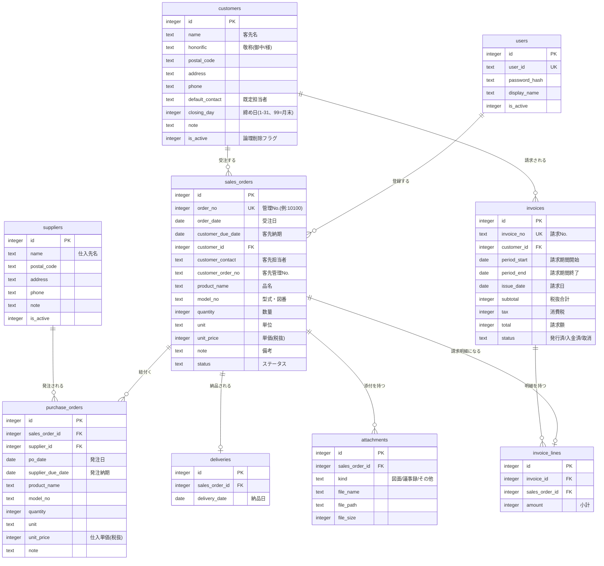

# 販売管理システム データベース設計書

- 版数: 1.1
- 前提: SQLite(WALモード)。将来 PostgreSQL へ移行可能なよう標準的なSQL型のみ使用する
- **DBファイルの配置**: アプリ稼働マシン(既存の社内運用サーバー等)のローカルディスクに置く。**NAS共有フォルダに直接配置して複数PCからSMB越しに開くことは禁止**(ネットワーク共有上ではファイルロックが機能せず破損リスクがあるため)。共有フォルダへはバックアップ(4章)として日次コピーする

## 1. ER図

## 2. テーブル定義

共通: 全テーブルに `created_at`(作成日時)、`updated_at`(更新日時)を持たせる(ER図では省略)。主要テーブル(sales_orders / purchase_orders / deliveries / invoices)の `created_by` / `updated_by`(users.id)は、ログイン機能(オプション)の導入時に追加する。

`attachments` と `users` はオプション機能用のテーブルであり、**初期版では作成しない**(機能追加時にマイグレーションで追加)。

### 2.1 customers(客先マスタ)

| 列 | 型 | 制約 | 説明 |
|----|----|------|------|
| id | INTEGER | PK AUTOINCREMENT | |
| name | TEXT | NOT NULL | 客先名(例: ダイゴテック) |
| honorific | TEXT | DEFAULT '御中' | 帳票宛名の敬称 |
| postal_code | TEXT | | |
| address | TEXT | | |
| phone | TEXT | | |
| default_contact | TEXT | | 既定の客先担当者(例: 山田) |
| closing_day | INTEGER | NOT NULL DEFAULT 99 CHECK(closing_day BETWEEN 1 AND 31 OR closing_day = 99) | 締め日。1〜31=その日、99=月末 |
| note | TEXT | | |
| is_active | INTEGER | NOT NULL DEFAULT 1 | 0=論理削除 |

### 2.2 suppliers(仕入先マスタ)

| 列 | 型 | 制約 | 説明 |
|----|----|------|------|
| id | INTEGER | PK AUTOINCREMENT | |
| name | TEXT | NOT NULL | 仕入先名(例: ゆーいち工業) |
| postal_code / address / phone / note | TEXT | | |
| is_active | INTEGER | NOT NULL DEFAULT 1 | |

### 2.3 sales_orders(受注)

| 列 | 型 | 制約 | 説明 |
|----|----|------|------|
| id | INTEGER | PK AUTOINCREMENT | |
| order_no | INTEGER | NOT NULL UNIQUE | 管理No.。採番ルールは 3.1 |
| order_date | DATE | NOT NULL | 受注日 |
| customer_due_date | DATE | NOT NULL | 客先納期 |
| customer_id | INTEGER | NOT NULL FK→customers.id | |
| customer_contact | TEXT | | 客先担当者 |
| customer_order_no | TEXT | | 客先管理No.(客先の注文書番号) |
| product_name | TEXT | NOT NULL | 品名 |
| model_no | TEXT | | 型式・図番 |
| quantity | INTEGER | NOT NULL CHECK(quantity > 0) | 数量 |
| unit | TEXT | DEFAULT 'ヶ' | 単位 |
| unit_price | INTEGER | NOT NULL CHECK(unit_price >= 0) | 税抜単価 |
| note | TEXT | | 備考(例: 表面処理注意) |
| status | TEXT | NOT NULL DEFAULT 'ordered' | ordered/po_issued/delivered/invoiced/paid/cancelled |

- 小計は保存せず `quantity * unit_price` を計算で得る(冗長保存による不整合を避ける)
- インデックス: `order_no`, `customer_id`, `order_date`, `status`

### 2.4 purchase_orders(発注)

| 列 | 型 | 制約 | 説明 |
|----|----|------|------|
| id | INTEGER | PK AUTOINCREMENT | |
| sales_order_id | INTEGER | NOT NULL FK→sales_orders.id | 紐付く受注 |
| supplier_id | INTEGER | NOT NULL FK→suppliers.id | |
| po_date | DATE | NOT NULL | 発注日 |
| supplier_due_date | DATE | NOT NULL | 発注納期 |
| product_name | TEXT | NOT NULL | 受注から引継ぎ(編集可) |
| model_no | TEXT | | |
| quantity | INTEGER | NOT NULL CHECK(quantity > 0) | |
| unit | TEXT | DEFAULT 'ヶ' | |
| unit_price | INTEGER | NOT NULL CHECK(unit_price >= 0) | 仕入単価(税抜) |
| note | TEXT | | |

### 2.5 deliveries(納品)

| 列 | 型 | 制約 | 説明 |
|----|----|------|------|
| id | INTEGER | PK AUTOINCREMENT | |
| sales_order_id | INTEGER | NOT NULL UNIQUE FK→sales_orders.id | 初期版は1受注=1納品のためUNIQUE |
| delivery_date | DATE | NOT NULL | 納品日 |

- 分納対応時は UNIQUE を外し数量列を追加する(将来拡張)

### 2.6 invoices(請求)

| 列 | 型 | 制約 | 説明 |
|----|----|------|------|
| id | INTEGER | PK AUTOINCREMENT | |
| invoice_no | TEXT | NOT NULL UNIQUE | 請求No.。採番ルールは 3.2 |
| customer_id | INTEGER | NOT NULL FK→customers.id | |
| period_start | DATE | NOT NULL | 請求期間の開始日(締め日から自動算出し、画面で修正された場合は確定時の値を保存) |
| period_end | DATE | NOT NULL | 請求期間の終了日(同上。period_start <= period_end) |
| issue_date | DATE | NOT NULL | 請求日 |
| subtotal | INTEGER | NOT NULL | 税抜合計 |
| tax | INTEGER | NOT NULL | 消費税(計算ルールは 3.3) |
| total | INTEGER | NOT NULL | 請求額 = subtotal + tax |
| status | TEXT | NOT NULL DEFAULT 'issued' | issued/paid/cancelled |

- 請求確定時点の金額を確定値として保存する(後から受注を修正しても請求書の金額は変わらない)

### 2.7 invoice_lines(請求明細)

| 列 | 型 | 制約 | 説明 |
|----|----|------|------|
| id | INTEGER | PK AUTOINCREMENT | |
| invoice_id | INTEGER | NOT NULL FK→invoices.id | |
| sales_order_id | INTEGER | NOT NULL FK→sales_orders.id | |
| amount | INTEGER | NOT NULL | 確定時点の小計(数量×単価) |

- 制約: 有効な請求(status != 'cancelled')において同一 sales_order_id が重複しないことをアプリ層で保証(二重請求防止)

### 2.8 attachments(添付ファイル)【オプション・初期版では未作成】

| 列 | 型 | 制約 | 説明 |
|----|----|------|------|
| id | INTEGER | PK AUTOINCREMENT | |
| sales_order_id | INTEGER | NOT NULL FK→sales_orders.id | |
| kind | TEXT | NOT NULL | drawing(図面)/minutes(議事録)/other |
| file_name | TEXT | NOT NULL | 元のファイル名 |
| file_path | TEXT | NOT NULL | NAS共有フォルダ上の保存パス(例: `\\NAS\販売管理\添付\{管理No}\`)。通常ファイルのためNAS直置きで問題なく、共有フォルダから直接参照できる |
| file_size | INTEGER | NOT NULL | バイト数(上限20MB) |

### 2.9 users(ユーザー)【オプション・初期版では未作成】

| 列 | 型 | 制約 | 説明 |
|----|----|------|------|
| id | INTEGER | PK AUTOINCREMENT | |
| user_id | TEXT | NOT NULL UNIQUE | ログインID |
| password_hash | TEXT | NOT NULL | bcrypt等でハッシュ化 |
| display_name | TEXT | NOT NULL | 表示名 |
| is_active | INTEGER | NOT NULL DEFAULT 1 | |

### 2.10 company_settings(自社情報・設定)

1行のみ保持する設定テーブル。

| 列 | 型 | 説明 |
|----|----|------|
| company_name | TEXT | 社名(帳票発行者名) |
| postal_code / address / phone | TEXT | |
| invoice_reg_no | TEXT | 適格請求書発行事業者登録番号(T+13桁) |
| bank_info | TEXT | 振込先(銀行/支店/種別/口座/名義) |
| tax_rate | INTEGER | 消費税率(%)。既定10 |
| next_order_no | INTEGER | 次に採番する管理No. |

## 3. ルール

### 3.1 管理No. 採番ルール

- 5桁の連番。初期値 10100(現行Excelの番号体系を引継ぎ)、新規受注ごとに +1
- `company_settings.next_order_no` をトランザクション内で取得・更新し、同時登録でも重複しないことを保証する
- 欠番は許容(キャンセルした案件の番号は再利用しない)

### 3.2 請求No. 採番ルール

- 形式: `INV-YYYYMM-NNN`(例: `INV-202607-001`)。YYYYMM は請求期間終了日(period_end)の年月、NNN はその年月内の連番

### 3.3 請求期間の自動算出ルール

- 客先の締め日 `d`(customers.closing_day)と締め対象の年月から次のように算出し、画面に初期表示する(開始日・終了日とも手修正可):
  - 期間終了日 = 対象月の `d` 日。`d = 99`(月末)はその月の末日。`d` がその月に存在しない場合(例: 31日締めの4月)は月末に丸める
  - 期間開始日 = 前月の締め日の翌日(同じ丸めルールを適用)
- 例: 20日締めの客先で2026年7月分 → 2026-06-21 〜 2026-07-20。月末締めの客先で2026年7月分 → 2026-07-01 〜 2026-07-31

### 3.4 金額計算ルール

| 項目 | ルール |
|------|--------|
| 小計 | 数量 × 単価(税抜)。例: 2 × 10,000 = 20,000 |
| 発注額 | 案件に紐付く発注小計の合計。例: 2 × 8,000 = 16,000 |
| 粗利 | 受注小計 − 発注額。例: 20,000 − 16,000 = 4,000 |
| 税抜合計 | 請求期間(period_start〜period_end)内の請求対象明細の小計合計 |
| 消費税 | 税抜合計 × 税率(10%)、**1円未満切り捨て**。請求書単位で1回だけ計算(明細ごとに税計算しない) |
| ご請求額 | 税抜合計 + 消費税。例: 20,000 + 2,000 = 22,000 |

### 3.5 ステータス遷移ルール

| status | 表示名 | 遷移条件 |
|--------|--------|---------|
| ordered | 受注済 | 受注登録時の初期値 |
| po_issued | 発注済 | 発注が1件以上登録された |
| delivered | 納品済 | 納品登録された |
| invoiced | 請求済 | 請求書が確定した(編集ロック) |
| paid | 入金済 | 請求一覧で入金済み操作 |
| cancelled | 取消 | 受注キャンセル(請求済以降は不可) |

- 請求取消時: 対象明細の受注は invoiced → delivered に戻す

## 4. バックアップ

- バックアップ先は **NAS共有フォルダ**(例: `\\NAS\販売管理\backup\`)とする
- SQLite DBファイルを日次で `VACUUM INTO`(または `.backup`)により整合性を保って取得し、日付付きファイル名(例: `sales_20260720.db`)でNASへコピー。**7世代以上保持**し、古いものから自動削除
- 添付ファイルはNAS共有フォルダが正本のため、NAS自体のバックアップ運用(別ドライブ・別フォルダへのコピー)を推奨
- アプリ稼働マシンの故障時は、最新バックアップDBを別のマシンに配置してアプリを再セットアップすれば復旧できる(復旧手順は実装フェーズで運用手順書として整備)
